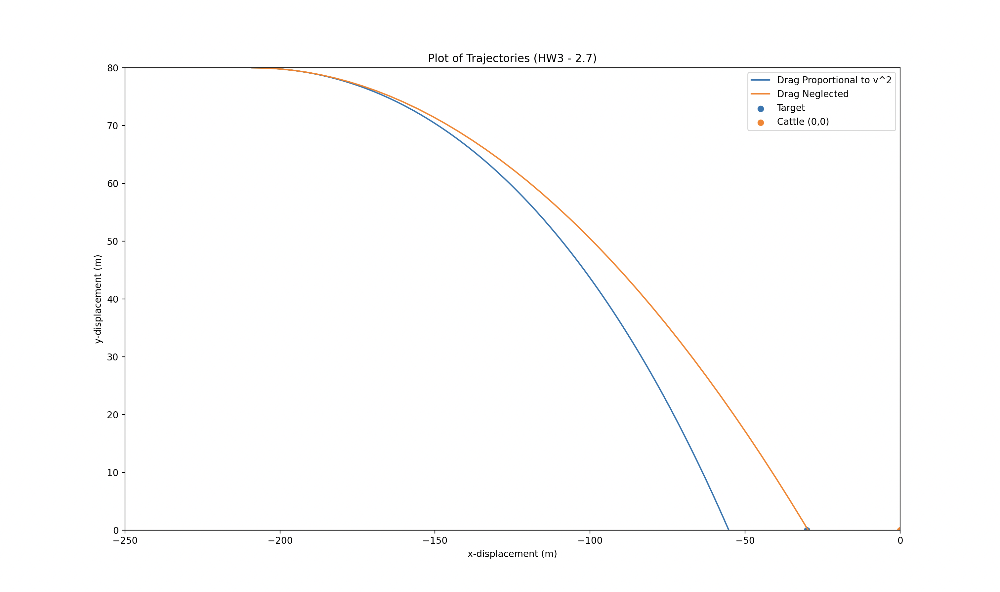

# Horizontal Motion (Classical Mechanics)
- Program to model a falling object experiencing a drag force proportional to the square of its speed.
- Computational approach to solving non-linear differential equations of motion.

